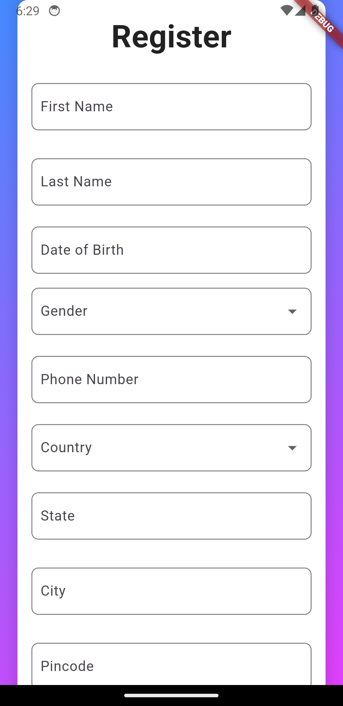
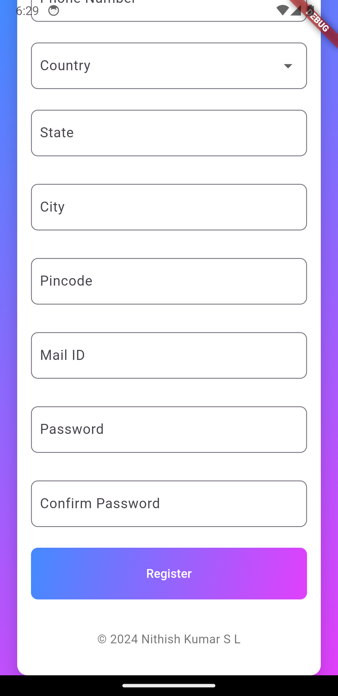
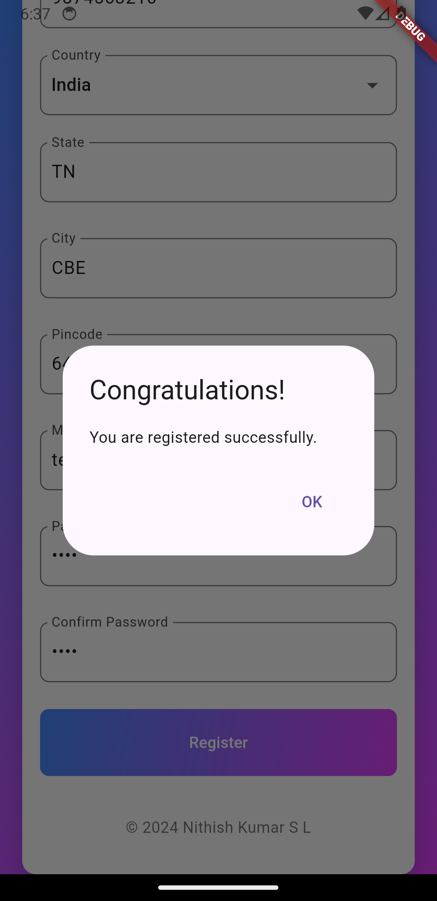

# 📱 Registration Form App

Welcome to the **Registration Form App**! 🎉 This Flutter application provides a modern and user-friendly registration form for capturing essential user details.

## 📸 Project Screenshot

## 🚀 Features

- **User Registration**: Enter name, date of birth, phone number, and more.
- **Dropdown Menus**: Select your country and gender.
- **Validation**: Ensure all required fields are filled.
- **Modern Design**: Enjoy a sleek gradient background and appealing UI.
- **Success Dialog**: Receive a confirmation upon successful registration.

## 💡 Usage

- **Open the app** and fill out the registration form.
- **Select your date of birth** and other details.
- **Submit the form** to see a confirmation dialog.

## 🔧 Contributing

Feel free to fork the repository and submit pull requests. 🛠

© ${DateTime.now().year} Nithish Kumar S L
